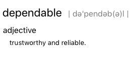
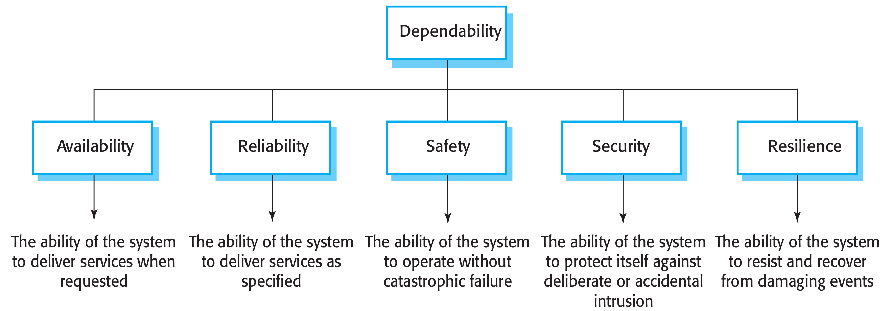
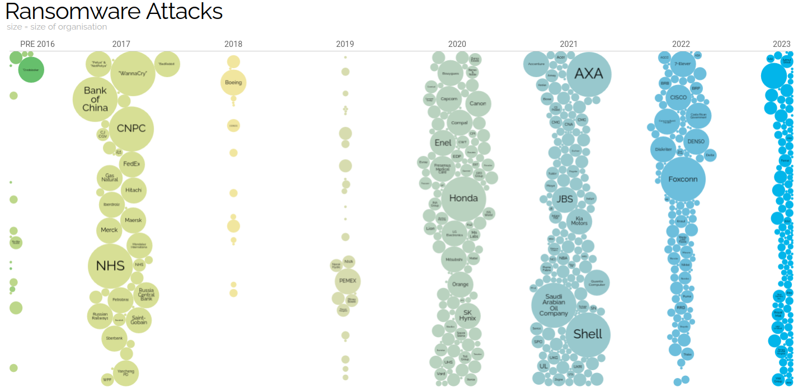
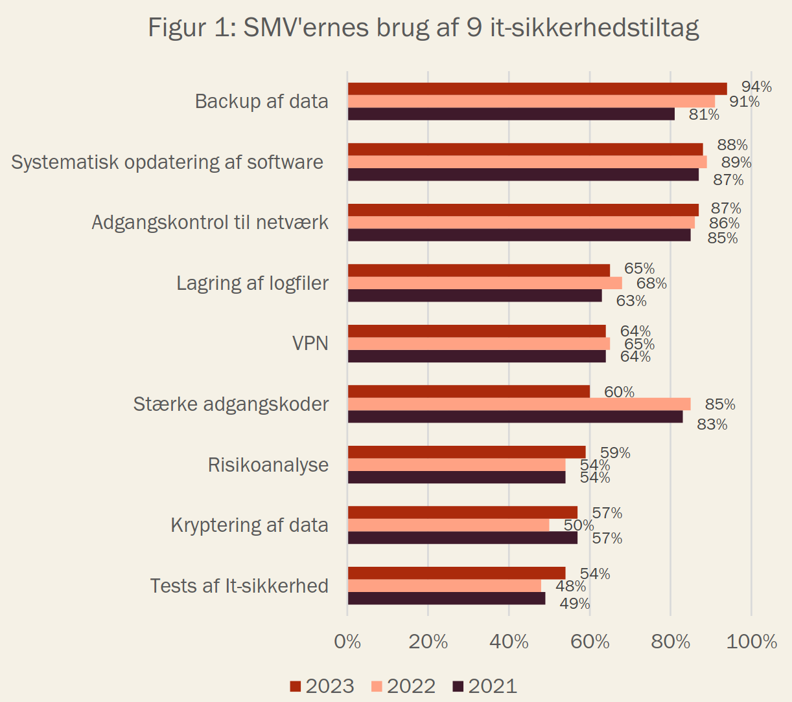
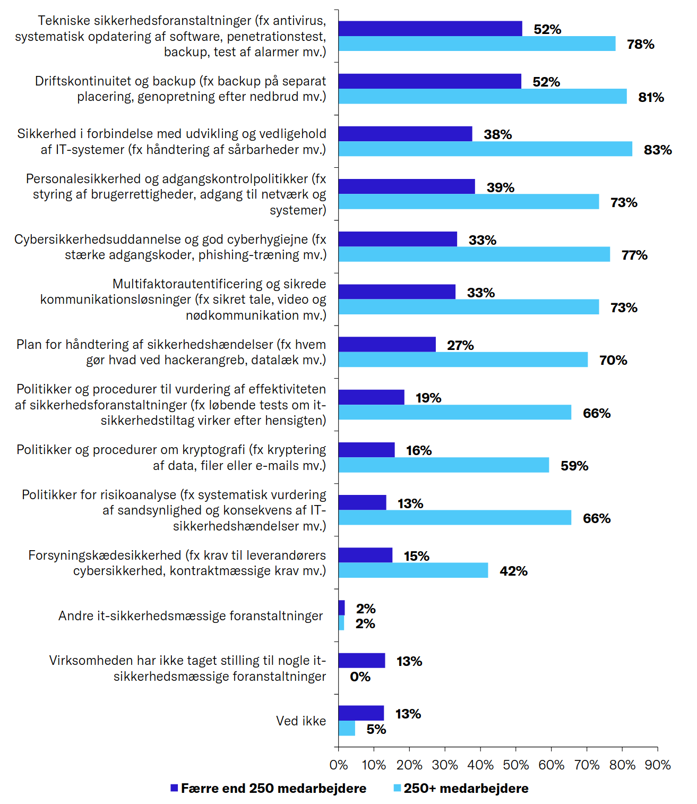
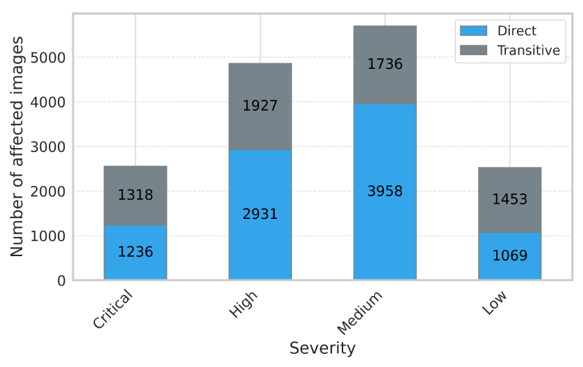
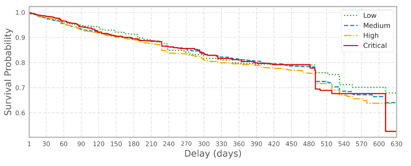

class: center, middle


# DevOps, Software Evolution and Software Maintenance

Helge Pfeiffer, Associate Professor,<br>
[Research Center for Government IT](https://www.itu.dk/forskning/institutter/institut-for-datalogi/forskningscenter-for-offentlig-it),<br>
[IT University of Copenhagen, Denmark](https://www.itu.dk)<br>
`ropf@itu.dk`

---

class: center, middle

# Feedback: The state of your projects?

---

### Release Activity

<object width="100%" data="http://209.38.211.172/release_activity_weekly.svg"></object>

---

### Weekly Commit Activity

<object width="100%" data="http://209.38.211.172/commit_activity_weekly.svg"></object>

---

### Latest processed events?

<object width="100%" data="http://64.226.108.122/chart.svg"></object>

---

### Error plot

<object width="100%" data="http://64.226.108.122/error_chart.svg"></object>

---

## How do you feel it is going with your projects?

---

### Building Dependable Software Systems



--



Image source: I. Sommerville _"Software Engineering"_ (10th Ed.)

<!--
> There are five principal dimensions to **dependability**:
>
> 1. **Availability** [...] the probability that it will be up and running and able to deliver useful services to users at any given time.
> 2. **Reliability** [...] the probability, over a given period of time, that the system will correctly deliver services as expected by the user.
> 3. **Safety** [...] how likely it is that the system will cause damage to people or its environment.
> 4. **Security** [...] how likely it is that the system can resist accidental or deliberate intrusions.
> 5. **Resilience** [...] how well that ­system can maintain the continuity of its critical services in the presence of ­disruptive events, such as equipment failure and cyberattacks.
>
> I. Sommerville _"Software Engineering"_ (10th Ed.)
 -->

---

### Historical Term: Site Reliability Engineer

The importance of reliability was recognized early by Google when they introduced the role of site reliability engineer and a [site-readability team in 2003](https://www.usenix.org/conference/srecon14/technical-sessions/presentation/keys-sre).

> The SRE role of today **combines** the skills of the **developer** responsible for writing applications and the skills that **operations engineers** use to deploy those applications.
>
> The SRE moves an application from proof of concept, to quality control, and then to deployment - **automating that entire process** and giving it consistency.
>
> [R. Howard _"On cybersecurity and IT teams of the future, we’ll all be SREs"_](https://www.csoonline.com/article/564047/on-cybersecurity-and-it-teams-of-the-future-we-will-all-be-sres.html)

> By **continuing to run security experiments**, we can evaluate and improve such vulnerabilities proactively in the ecosystem before they become crisis situations.
>
> [ A. Rinehart and P. Bergstrom _"Through the looking glass: Security and the SRE"_](https://opensource.com/article/18/3/through-looking-glass-security-sre)

--

> **DevSecOps** is seen as a necessary expansion to DevOps, where the purpose is to integrate security controls and processes into the DevOps software development cycle [21] and that it is done by promoting the collaboration between security teams, development teams and operations teams [11].
>
> [H. Myrbakken & R. Colomo-Palacios _"DevSecOps: a multivocal literature review"_](http://rcolomo.com/papers/314.pdf)

---


### "Information wants to be free"


> Information wants to be free (because of the new ease of copying and reshaping and casual distribution), AND
>
> information wants to be expensive (it’s the prime economic event in an information age)...  and
>
> technology is constantly making the tension worse.
>
> [S. Brand _"The history of “information wants to be free”..."_](https://sb.longnow.org/SB_homepage/Info_free_story.html)

--

The information in your systems wants to be free and many people are after it. Your goal is to protect it. This is **cyber security**:

> The approach and actions associated with security risk management processes followed by organizations and states to protect confidentiality, integrity and availability of data and assets used in cyber space. The concept includes guidelines, policies and collections of safeguards, technologies, tools and training to provide the best protection for the state of the cyber environment and its users.
>
> [D. Schatz, R. Bashroush, and J. Wall _"Towards a More Representative Definition of Cyber Security"_](https://commons.erau.edu/cgi/viewcontent.cgi?article=1476&context=jdfsl)

---


## Motivational Story from Mircea

Mircea moved his web-application from one server to another.

Next day, he realizes that the ElasticSearch queries don't work anymore.
He queries the main index and doesn't find it.
He looks for all the indexes, and there is a new index in the db called `__read__me`.
This is bad.

He lists the documents in it, and it has only a single document:

--


---

## Motivational Story from Mircea


How could this happen?

Let's see what I deployed on the new server:
- Flask API talks to ElasticSearch and MySQL
- NGINX - as *reverse proxy* + TLS provide
- `ufw` rules to block everything but ports 80 and 443
- Relevant `docker-compose.yml` fragment is highlighted near the *elasticsearch*


---

## Motivational Story from Mircea: How could this happen?

The answer is a combination of factors:
- Docker circumvents the UFW firewall and alters `iptables` directly when you apply port mappings ports
- Mapping the ports with `-p 9200:9200` (or in `docker-compose.yml`) maps the port to the host but also opens it to the world! ([bug report from '19](https://github.com/docker/for-linux/issues/690))
  > Publishing ports produce a firewall rule that binds a container port to a port on the Docker host, ensuring the ports are accessible to any client that can communicate with the host.

- ElasticSearch server was not password protected - because Mircea was sure that it's behind a firewall

---

## Motivational Story from Mircea: How could this happen?

Lessons learned:
- You must know how the tools you work with work! For example, [configure Docker to not do this](https://www.techrepublic.com/article/how-to-fix-the-docker-and-ufw-security-flaw/)
- You must have a backup - luckily the ES database was backed up
- **Do not rely on a single security mechanism**, e.g., firewall, but use multiple, e.g., protect the database also with a password.

Practical:
- Can you map the port for Grafana? Yes.
- See also: [configure Docker to not do this](https://www.techrepublic.com/article/how-to-fix-the-docker-and-ufw-security-flaw/)

---

## Interesting story, the threat is real!

> Ud af de 1.200 undersøgte organisationer, der var påvirket af ransomware, tog svimlende 80 % den svære beslutning om at betale for at stoppe cyberangrebet og gendanne deres tabte data.
>
> [T. Pedersen _"80% betaler ved ransomware angreb"_](https://www.dkits.dk/post/80-betaler-ved-ransomware-angreb)



Image source: https://informationisbeautiful.net/visualizations/ransomware-attacks/


* [_"'Ransomware'-hackere stjæler data, kræver løsesummer - og lammer danske virksomheder"_](https://www.dr.dk/nyheder/indland/ransomware-hackere-stjaeler-data-kraever-loesesummer-og-lammer-danske-virksomheder)
* [P. Kruse _"Danmark under ransomware angreb i 2024"_](https://www.kruse.industries/l/danmark-under-ransomware-angreb-i-2024/)
* [_"Ny rapport: Danske virksomheder mest villige til at betale løsepenge til hackere"_](https://www.securityworldmarket.com/dk/Nyheder/Erhvervsnyheder/ny-rapport-danske-virksomheder-mest-villige-til-at-betale-losepenge-til-hackere)

---

## State of Security in Denmark



Source: [Styrelsen for Samfundssikkerhed _"Digital sikkerhed i danske SMV’er 2024"_](https://www.sikkerdigital.dk/Media/638762615322602677/Digital%20sikkerhed%20i%20danske%20SMV'er%202024_Webtilg%C3%A6ngelig.pdf)

---

## State of Security in Denmark



Source: [Dansk Erhverv (2026) _"Cybersikkerhed i erhvervslivet"_](https://www.danskerhverv.dk/siteassets/mediafolder/dokumenter/01-analyser/analysenotater-2026/cybersikkerhed-i-erhvervslivet-2026.pdf)

---

class: center, middle

# What can we do about security?

---

class: center, middle

# Security from the Outside

---

### Forward/Web Proxy

> A forward proxy, often called a proxy, proxy server, or web proxy, is a server that sits in front of a group of client machines. When those computers make requests to sites and services on the Internet, the proxy server intercepts those requests and then communicates with web servers on behalf of those clients, like a middleman.
>
> [Cloudflare _"What is a reverse proxy?"_](https://www.cloudflare.com/learning/cdn/glossary/reverse-proxy/)


--

Why do I need one?

> * To avoid state or institutional browsing restrictions
> * To block access to certain content
> * To protect users identity online
>
> Adapted from [Cloudflare _"What is a reverse proxy?"_](https://www.cloudflare.com/learning/cdn/glossary/reverse-proxy/)


* Denmark blocks websites too [B. G. Jochumsen _"En komplet oversigt over eksisterende blokeringer af internetsider i Danmark"_](https://www.advokatavisen.dk/artikler/en-komplet-oversigt-over-eksisterende-blokeringer-af-internetsider-i-danmark-325/)

---

### Reverse Proxy

> A reverse proxy is a server that sits in front of web servers and forwards client (e.g. web browser) requests to those web servers. Reverse proxies are typically implemented to help increase security, performance, and reliability.
>
> This is different from a forward proxy, where the proxy sits in front of the clients. With a reverse proxy, when clients send requests to the origin server of a website, those requests are intercepted at the network edge by the reverse proxy server. The reverse proxy server will then send requests to and receive responses from the origin server.
>
> [Cloudflare _"What is a reverse proxy?"_](https://www.cloudflare.com/learning/cdn/glossary/reverse-proxy/)


---

### Reverse Proxy


Why do I need one?

> * Protection from attacks
> * Caching
> * SSL encryption
> * Load balancing
>
> Adapted from [Cloudflare _"What is a reverse proxy?"_](https://www.cloudflare.com/learning/cdn/glossary/reverse-proxy/)

---

### Reverse Proxy

Typical webservers that you might consider when setting up a reverse proxy for your project:

* [Nginx](https://docs.nginx.com/nginx/admin-guide/web-server/reverse-proxy/)
* [Apache httpd](https://httpd.apache.org/docs/2.4/howto/reverse_proxy.html)
* [HAProxy](https://www.haproxy.org/)
* [Traefik](https://doc.traefik.io/traefik/)
* [Caddy](https://caddyserver.com/docs/quick-starts/reverse-proxy)
* [lighttpd](https://www.lighttpd.net/)

---

### TLS Encryption

> SSL, or Secure Sockets Layer, is an encryption-based Internet security protocol. It was first developed by Netscape in 1995 for the purpose of ensuring privacy, authentication, and data integrity in Internet communications. SSL is the predecessor to the modern TLS encryption used today.
>
> A website that implements SSL/TLS has "HTTPS" in its URL instead of "HTTP."
>
> [Cloudflare _"What is SSL?"_](https://www.cloudflare.com/learning/ssl/what-is-ssl/)

--


--

In BDSA, when deploying to a PaaS (Azure App Service), you [got that provided for free](https://learn.microsoft.com/en-us/azure/app-service/configure-ssl-certificate?tabs=apex%2Crbac%2Cazure-cli).
Now, that you are responsible for managing infrastructure (IaaS), you are responsible to setup, configure, and maintain that too.

---

### Unencrypted HTTP Connection, what is the problem?

Secrets are transfered over public servers in plain-text:

```bash
sudo tcpdump -s 0 -A -n -l | egrep -i "POST /|pwd=|passwd=|pass=|password=|Host:"
```


Example source: https://linuxhandbook.com/tcpdump-http-traffic-analysis/

---

### TLS encryption: Certificate?

> An SSL/TLS certificate is a **digital object** that allows systems to verify the identity & subsequently establish an encrypted network connection to another system using the Secure Sockets Layer/Transport Layer Security (SSL/TLS) protocol. Certificates are used within a cryptographic system known as a **public key infrastructure** (PKI). PKI provides a way for one party to **establish the identity of another party** using certificates **if they both trust a third-party** - known as a **certificate authority**. SSL/TLS certificates thus act as digital identity cards to secure network communications, establish the identity of websites over the Internet as well as resources on private networks.
>
> https://aws.amazon.com/what-is/ssl-certificate/

--

> Let's Encrypt is a non-profit certificate authority run by Internet Security Research Group (ISRG) that provides X.509 certificates for Transport Layer Security (TLS) encryption without charging fees. It is the world's largest certificate authority
>
> https://en.wikipedia.org/wiki/Let's_Encrypt

---

### TLS encryption

Inspecting a TLS certificate from Google.

```bash
$ echo \
  | openssl s_client -showcerts -servername google.com -connect google.com:443 2>/dev/null \
  | openssl x509 -inform pem -noout -text
```

```
Certificate:
    Data:
        Version: 3 (0x2)
        Serial Number:
            1c:fb:1d:f7:99:b3:a3:61:10:d3:9b:8e:7d:3c:a8:53
        Signature Algorithm: sha256WithRSAEncryption
        Issuer: C = US, O = Google Trust Services, CN = WR2
        Validity
            Not Before: Feb 23 18:19:44 2026 GMT
            Not After : May 18 18:19:43 2026 GMT
        Subject: CN = *.google.com
        Subject Public Key Info:
            Public Key Algorithm: id-ecPublicKey
                Public-Key: (256 bit)
                pub:
                    04:6a:52:2a:06:ba:4b:8a:e1:45:6b:1a:fd:64:ae:
                    92:d7:a5:b6:2b:a2:40:09:4a:8e:5e:26:fd:18:70:
                    b2:65:e9:ad:47:31:69:6c:67:8f:df:7f:37:67:5a:
                    c7:41:43:e2:a8:fd:3b:07:d3:d8:51:c6:b0:63:31:
                    6f:39:0f:00:d4
                ASN1 OID: prime256v1
                NIST CURVE: P-256
        X509v3 extensions:
            X509v3 Key Usage: critical
                Digital Signature
            X509v3 Extended Key Usage:
                TLS Web Server Authentication
            X509v3 Basic Constraints: critical
                CA:FALSE
            X509v3 Subject Key Identifier:
                8C:B1:D0:61:69:87:72:89:3D:93:76:C4:CB:B1:22:AF:A9:E4:C1:CA
            X509v3 Authority Key Identifier:
                DE:1B:1E:ED:79:15:D4:3E:37:24:C3:21:BB:EC:34:39:6D:42:B2:30
            Authority Information Access:
                OCSP - URI:http://o.pki.goog/wr2
                CA Issuers - URI:http://i.pki.goog/wr2.crt
            X509v3 Subject Alternative Name:
                DNS:*.google.com, DNS:*.appengine.google.com, DNS:*.bdn.dev, DNS:*.origin-test.bdn.dev, DNS:*.cloud.google.com, DNS:*.crowdsource.google.com, DNS:*.datacompute.google.com, DNS:*.google.ca, DNS:*.google.cl, DNS:*.google.co.in, DNS:*.google.co.jp, DNS:*.google.co.uk, DNS:*.google.com.ar, DNS:*.google.com.au, DNS:*.google.com.br, DNS:*.google.com.co, DNS:*.google.com.mx, DNS:*.google.com.tr, DNS:*.google.com.vn, DNS:*.google.de, DNS:*.google.es, DNS:*.google.fr, DNS:*.google.hu, DNS:*.google.it, DNS:*.google.nl, DNS:*.google.pl, DNS:*.google.pt, DNS:*.googleapis.cn, DNS:*.gstatic.cn, DNS:*.gstatic-cn.com, DNS:googlecnapps.cn, DNS:*.googlecnapps.cn, DNS:googleapps-cn.com, DNS:*.googleapps-cn.com, DNS:gkecnapps.cn, DNS:*.gkecnapps.cn, DNS:googledownloads.cn, DNS:*.googledownloads.cn, DNS:recaptcha.net.cn, DNS:*.recaptcha.net.cn, DNS:recaptcha-cn.net, DNS:*.recaptcha-cn.net, DNS:widevine.cn, DNS:*.widevine.cn, DNS:ampproject.org.cn, DNS:*.ampproject.org.cn, DNS:ampproject.net.cn, DNS:*.ampproject.net.cn, DNS:google-analytics-cn.com, DNS:*.google-analytics-cn.com, DNS:googleadservices-cn.com, DNS:*.googleadservices-cn.com, DNS:googlevads-cn.com, DNS:*.googlevads-cn.com, DNS:googleapis-cn.com, DNS:*.googleapis-cn.com, DNS:googleoptimize-cn.com, DNS:*.googleoptimize-cn.com, DNS:doubleclick-cn.net, DNS:*.doubleclick-cn.net, DNS:*.fls.doubleclick-cn.net, DNS:*.g.doubleclick-cn.net, DNS:doubleclick.cn, DNS:*.doubleclick.cn, DNS:*.fls.doubleclick.cn, DNS:*.g.doubleclick.cn, DNS:dartsearch-cn.net, DNS:*.dartsearch-cn.net, DNS:googletraveladservices-cn.com, DNS:*.googletraveladservices-cn.com, DNS:googletagservices-cn.com, DNS:*.googletagservices-cn.com, DNS:googletagmanager-cn.com, DNS:*.googletagmanager-cn.com, DNS:googlesyndication-cn.com, DNS:*.googlesyndication-cn.com, DNS:*.safeframe.googlesyndication-cn.com, DNS:app-measurement-cn.com, DNS:*.app-measurement-cn.com, DNS:gvt1-cn.com, DNS:*.gvt1-cn.com, DNS:gvt2-cn.com, DNS:*.gvt2-cn.com, DNS:2mdn-cn.net, DNS:*.2mdn-cn.net, DNS:googleflights-cn.net, DNS:*.googleflights-cn.net, DNS:admob-cn.com, DNS:*.admob-cn.com, DNS:*.gemini.cloud.google.com, DNS:googlesandbox-cn.com, DNS:*.googlesandbox-cn.com, DNS:*.safenup.googlesandbox-cn.com, DNS:*.gstatic.com, DNS:*.metric.gstatic.com, DNS:*.gvt1.com, DNS:*.gcpcdn.gvt1.com, DNS:*.gvt2.com, DNS:*.gcp.gvt2.com, DNS:*.url.google.com, DNS:*.youtube-nocookie.com, DNS:*.ytimg.com, DNS:ai.android, DNS:android.com, DNS:*.android.com, DNS:*.flash.android.com, DNS:g.cn, DNS:*.g.cn, DNS:g.co, DNS:*.g.co, DNS:goo.gl, DNS:www.goo.gl, DNS:google-analytics.com, DNS:*.google-analytics.com, DNS:google.com, DNS:googlecommerce.com, DNS:*.googlecommerce.com, DNS:ggpht.cn, DNS:*.ggpht.cn, DNS:urchin.com, DNS:*.urchin.com, DNS:youtu.be, DNS:youtube.com, DNS:*.youtube.com, DNS:music.youtube.com, DNS:*.music.youtube.com, DNS:youtubeeducation.com, DNS:*.youtubeeducation.com, DNS:youtubekids.com, DNS:*.youtubekids.com, DNS:yt.be, DNS:*.yt.be, DNS:android.clients.google.com, DNS:*.android.google.cn, DNS:*.chrome.google.cn, DNS:*.developers.google.cn, DNS:*.aistudio.google.com
            X509v3 Certificate Policies:
                Policy: 2.23.140.1.2.1
            X509v3 CRL Distribution Points:
                Full Name:
                  URI:http://c.pki.goog/wr2/oQ6nyr8F0m0.crl
            CT Precertificate SCTs:
                Signed Certificate Timestamp:
                    Version   : v1 (0x0)
                    Log ID    : 0E:57:94:BC:F3:AE:A9:3E:33:1B:2C:99:07:B3:F7:90:
                                DF:9B:C2:3D:71:32:25:DD:21:A9:25:AC:61:C5:4E:21
                    Timestamp : Feb 23 19:19:50.221 2026 GMT
                    Extensions: none
                    Signature : ecdsa-with-SHA256
                                30:46:02:21:00:DD:FB:F8:B7:39:CC:E6:8B:AC:D0:CE:
                                F3:C8:4E:69:91:19:A9:0B:E0:B4:5A:6E:54:A5:38:35:
                                3C:53:39:24:B4:02:21:00:93:C9:41:BD:22:ED:6A:1C:
                                5D:ED:A1:A4:6D:4B:B1:55:5A:CA:49:4A:40:B5:06:EA:
                                19:2B:F3:86:FC:D8:F0:27
                Signed Certificate Timestamp:
                    Version   : v1 (0x0)
                    Log ID    : CB:38:F7:15:89:7C:84:A1:44:5F:5B:C1:DD:FB:C9:6E:
                                F2:9A:59:CD:47:0A:69:05:85:B0:CB:14:C3:14:58:E7
                    Timestamp : Feb 23 19:19:50.277 2026 GMT
                    Extensions: none
                    Signature : ecdsa-with-SHA256
                                30:45:02:21:00:9B:D1:2D:BA:2C:0D:8D:7E:5C:50:89:
                                C6:6B:BD:16:9D:3D:B9:C8:72:5B:C0:F3:F4:FF:8A:E5:
                                22:EE:0D:D9:BE:02:20:44:B8:D8:FD:F7:26:16:77:18:
                                09:71:E5:EB:7F:AD:68:74:A3:84:A1:DF:30:EE:3F:B2:
                                D6:5A:33:31:54:9A:19
    Signature Algorithm: sha256WithRSAEncryption
    Signature Value:
        4d:9a:b8:d6:9c:aa:e3:93:84:fc:c8:93:71:30:68:ef:5f:67:
        f7:9e:c8:15:cb:1c:7a:56:10:25:84:28:5f:57:08:c7:22:30:
        b4:c2:ea:13:f9:3f:91:6d:86:f9:33:47:e6:fe:51:29:39:22:
        5a:fb:4f:3d:33:3a:d3:f6:63:e9:9b:38:98:9c:9e:10:32:68:
        ea:c7:e9:ed:a5:ae:3a:e9:fb:5e:af:72:73:19:8f:51:d1:c2:
        14:cb:20:4a:ce:19:40:6d:3e:e5:6e:d3:0c:9f:89:fa:dd:7d:
        0d:5b:28:09:ae:b4:47:12:24:95:0d:a3:74:c1:9f:da:db:10:
        c7:eb:29:45:6c:49:90:1f:28:6b:40:bb:fc:f0:6b:88:be:9e:
        04:47:a0:fc:8a:29:97:f0:6b:84:97:7e:d4:20:f9:10:a5:c2:
        b2:bc:f3:af:4e:2b:8c:7c:66:31:b1:4c:ad:6e:75:b7:09:61:
        30:36:4f:13:61:de:01:93:af:28:12:60:e3:82:98:74:5f:38:
        f3:4f:78:35:a8:0f:02:8a:17:ba:f6:63:ed:3f:c5:b2:e4:50:
        57:a9:4b:74:84:26:3a:46:a7:98:b9:8d:a3:16:2f:bb:45:6e:
        ce:27:b0:f1:cd:f7:77:e4:5a:72:7f:10:03:11:05:44:60:df:
        36:ba:98:6d
```

Source: https://dev.to/bogkonstantin/what-is-a-tls-certificate-with-an-example-i1j

---

### TLS encryption

Use of HTTP without TLS is considered a "security smell" as reported by [A. Rahman, C. Parnin, and L. Williams _"The Seven Sins: Security Smells in Infrastructure as Code Scripts"_](https://akondrahman.github.io/files/papers/icse19_slic.pdf)


The first task of this week's project work is to fix that, see the [TLS tutorial](./TLSTutorial.md).

---

### Firewall

> a firewall builds a blockade between an internal network that is assumed to be secure and trusted, and another network, usually an external (inter)network, such as the Internet, that is not assumed to be secure and trusted.
>
> [R. Oppliger Internet security: firewalls and beyond](https://dl.acm.org/doi/epdf/10.1145/253769.253802)

--

Firewalls can be implemented either in hardware or software.
We will focus on software firewalls, in particular:

> Packet filtering firewall
>
> These firewalls scrutinize each packet of data that passes through them, and then filters them based on parameters like source and destination IP addresses, port numbers, and protocol types. While these firewalls are relatively simple and cost-effective, they are unable to examine the contents of packets, which makes them less effective against sophisticated attacks.
>
> [Cisco _"What is a firewall?"_](https://www.cisco.com/site/us/en/learn/topics/security/what-is-a-firewall.html)

---

### Firewall

On Linux systems, `iptables` is a typical packet filtering firewall.

> The `iptables` utility is a software firewall for Linux distributions that lets you control how network traffic is handled by the Linux kernel. With iptables, you can define rules that match traffic by properties like protocol, port, source or destination address, and network interface, and then decide whether to allow it, block it, or log it.
>
> https://www.digitalocean.com/community/tutorials/iptables-essentials-common-firewall-rules-and-commands

--

On BSD Unixes, `pf` is the most common packet filtering firewall.

> PF is a packet filter, that is, code which inspects network packets at the protocol and port level, and decides what to do with them. [...]
>
> PF operates in a world which consists of packets, protocols, connections and ports.
>
> Based on where a packet is coming from or where it's going, which protocol, connection or port it is designated for, PF is able to determine where to lead the packet, or decide if it is to be let through at all.
>
> [Peter N. M. Hansteen _"Firewalling with OpenBSD's PF packet filter"_](https://home.nuug.no/~peter/pf/en/)

See also https://www.openbsd.org/faq/pf/tables.html and https://docs.freebsd.org/en/books/handbook/firewalls/.

---

### Firewall

On Ubuntu-based Linuxes, one usually relies on UFW

> UFW, or _Uncomplicated Firewall_, is an interface for iptables designed to make firewall configuration more straightforward. While the underlying iptables system is powerful and flexible, it can be challenging for beginners to learn and use correctly. UFW simplifies this process, making it a good choice for users who need to secure their network without mastering complex firewall rules.
>
> https://www.digitalocean.com/community/tutorials/how-to-set-up-a-firewall-with-ufw-on-ubuntu

See also https://ubuntu.com/server/docs/how-to/security/firewalls/.

---

### Firewall


For example, to allow SSH, HTTP, and HTTPS traffic on a Linux server with `iptables`:

```bash
sudo iptables -A INPUT -p tcp --dport 22 -j ACCEPT
sudo iptables -A INPUT -p tcp --dport 80 -j ACCEPT
sudo iptables -A INPUT -p tcp --dport 443 -j ACCEPT
```

--

Or via `ufw`:

```bash
sudo ufw allow ssh
sudo ufw allow http
sudo ufw allow https
```

---

### Firewall

* Blocking traffic from an IP Address:
```bash
sudo ufw deny from 203.0.113.100
```

* Blocking traffic from a [subnet](https://www.cloudflare.com/learning/network-layer/what-is-a-subnet/), see [Classless Inter-Domain Routing (CIDR) for notation](https://en.wikipedia.org/wiki/Classless_Inter-Domain_Routing):
```bash
sudo ufw deny from 203.0.113.0/24
```

* Allowing traffic from an IP Address:
```bash
sudo ufw allow from 203.0.113.101
```

* Allowing traffic from an IP Address only on a specific network interface:
```bash
sudo ufw allow in on eth0 from 203.0.113.102
```

*  Allowing only HTTPS traffic to a webserver via an application profile:
```bash
sudo ufw allow "Nginx HTTPS"
sudo ufw delete allow "Nginx Full"
```

Examples adapted from [DigitalOcean](https://www.digitalocean.com/community/tutorials/ufw-essentials-common-firewall-rules-and-commands)

---

### Firewall

Configuring firewalls for production systems is not straight forward.
There are books written about it.

[Peter N. M. Hansteen _"The Book of PF"_](https://nostarch.com/book-of-pf-4e)


---

### Your Turn! -  `Task`: Firewall, why does it matter?


  - If not installed yet, install the `nmap` port scanner via `sudo apt install nmap`
  - From your terminal, execute the command `nmap -sV -p0-100 <your_host_ip>` to scan all open ports between port 0 and port 100.
    - Replace `<your_host_ip>` with the public IP address of the server that hosts your _ITU-MiniTwit_ web-application.
    - Likely, this is the IP address that you registered in [`repositories.py`](https://github.com/itu-devops/BSc_lecture_notes/blob/master/repositories.py).
  - Which ports are open on your server?
  - Which version of program is listening to the respective ports?
  - Can you identify any vulnerabilities for these programs in the [CVEdetails database](https://www.cvedetails.com/)?

---

### Firewall: Why does it matter?

In the exercise session, you will run a port scanner `nmap` to identify which versions of certain software are running on a server.
You will use an automated vulnerability exploitation tool, Metasploit, to gain root access on a vulnerable target host.

```
$ nmap -sV -p0-100 <your_host>
Starting Nmap 7.95 ( https://nmap.org ) at 2025-04-07 19:30 UTC
Nmap scan report for vulnerable.aa (172.20.0.4)
Host is up (0.000013s latency).
rDNS record for 172.20.0.4: vulnerable.aa.pentest
Not shown: 96 closed tcp ports (reset)
PORT   STATE SERVICE VERSION
21/tcp open  ftp     vsftpd 2.3.4
22/tcp open  ssh     OpenSSH 4.7p1 Debian 8ubuntu1 (protocol 2.0)
23/tcp open  telnet  Linux telnetd
25/tcp open  smtp    Postfix smtpd
80/tcp open  http    Apache httpd 2.2.8 ((Ubuntu) DAV/2)
--snip--
```

--

```
msf6 > search vsftpd
--snip--
#  Name                                 Disclosure Rank      Check Description
-  ----                                 ---------- ----      ----- -----------
0  auxiliary/dos/ftp/vsftpd_232         2011-02-03 normal    Yes   VSFTPD 2.3.2 Denial of Service
1  exploit/unix/ftp/vsftpd_234_backdoor 2011-07-03 excellent No    VSFTPD v2.3.4 Backdoor Command Execution
```

---

class: center, middle

# Security from the Inside

---

### More Static Analysis Tools, Application Level

Your application should be secure in the sense of that is relies on contemporary encryption algorithms, does not contain hardcoded secrets, etc.
For example `bandit` performs such security related static analysis.
It is an exemplary "Static Application Security Testing (SAST) tool"

```bash
$ bandit minitwit.py
[main]  INFO  profile include tests: None
[main]  INFO  profile exclude tests: None
[main]  INFO  cli include tests: None
[main]  INFO  cli exclude tests: None
[main]  INFO  running on Python 3.9.12
Run started:2026-03-19 13:21:15.883362

Test results:
>> Issue: [B106:hardcoded_password_funcarg] Possible hardcoded password: 'development key'
   Severity: Low   Confidence: Medium
   CWE: CWE-259 (https://cwe.mitre.org/data/definitions/259.html)
   More Info: https://bandit.readthedocs.io/en/1.8.6/plugins/b106_hardcoded_password_funcarg.html
   Location: ./minitwit.py:21:18
20  # Load default config and override config from an environment variable
21  app.config.update(dict(
22      DEBUG=True,
23      SECRET_KEY='development key'))
24  app.config.from_envvar('MINITWIT_SETTINGS', silent=True)

--------------------------------------------------
>> Issue: [B324:hashlib] Use of weak MD5 hash for security. Consider usedforsecurity=False
   Severity: High   Confidence: High
   CWE: CWE-327 (https://cwe.mitre.org/data/definitions/327.html)
   More Info: https://bandit.readthedocs.io/en/1.8.6/plugins/b324_hashlib.html
   Location: ./minitwit.py:41:12
40      return 'http://www.gravatar.com/avatar/%s?d=identicon&s=%d' % \
41             (md5(email.strip().lower().encode('utf-8')).hexdigest(), size)
42

--------------------------------------------------
>> Issue: [B104:hardcoded_bind_all_interfaces] Possible binding to all interfaces.
   Severity: Medium   Confidence: Medium
   CWE: CWE-605 (https://cwe.mitre.org/data/definitions/605.html)
   More Info: https://bandit.readthedocs.io/en/1.8.6/plugins/b104_hardcoded_bind_all_interfaces.html
   Location: ./minitwit.py:203:17
202 if __name__ == '__main__':
203     app.run(host="0.0.0.0")
```

---

### More Static Analysis Tools, Application Level

A similar tool in the .NET realm is [Security Code Scan](https://security-code-scan.github.io/)


---

### More Static Analysis Tools, Application Level

Similarly, Microsoft Static Analysis tools can be integrated directly into GitHub Actions Workflows.


See for example:

  * https://learn.microsoft.com/en-us/dotnet/devops/dotnet-secure-github-action
  * https://docs.github.com/en/get-started/learning-about-github/about-github-advanced-security

Image source: https://devblogs.microsoft.com/premier-developer/microsoft-security-code-analysis/

---

### More Static Analysis Tools, Application Level

[Semgrep](https://github.com/semgrep/semgrep) is a generic static analysis tool that allows to define static analysis rules via abstract syntax tree (AST) patterns.
There exists a list of [open-source security rules](https://github.com/semgrep/semgrep-rules), also for C#/.NET.


--

Find a list of Static Application Security Testing (SAST) tools on ["OWASP Source Code Analysis Tools" list](https://owasp.org/www-community/Source_Code_Analysis_Tools).

---

### Do you remember what Docker images are?

<a href="../session_02/images/deps.png"></a>

What is this?

--

A threat to security.
Each bundled application, library, dependency can contain vulnerabilities introducing a potential exploitation vector.

---

### Security Vulnerabilities Bundled in Docker Images





Source [H. Mohayeji, E. Constantinou, and A. Serebrenik, (2025) _"Security Vulnerabilities in Docker Images: A Cross-Tag Study of Application Dependencies"_](https://pure.tue.nl/ws/portalfiles/portal/363783544/ICSME2025.pdf)

<!--
* [C. Lin, S. Nadi, and H. Khazaei _"A Large-scale Data Set and an Empirical Study of Docker Images Hosted on Docker Hub"_](https://www.researchgate.net/profile/Hamzeh-Khazaei/publication/344198434_A_Large-scale_Data_Set_and_an_Empirical_Study_of_Docker_Images_Hosted_on_Docker_Hub/links/5f5aec4da6fdcc116409389c/A-Large-scale-Data-Set-and-an-Empirical-Study-of-Docker-Images-Hosted-on-Docker-Hub.pdf)
* [R. Shu, X. Gu, and W. Enck, _"A Study of Security Vulnerabilities on Docker Hub"_](https://dl.acm.org/doi/pdf/10.1145/3029806.3029832)
* [B. Tak et al. _"Security Analysis of Container Images using Cloud Analytics Framework"_](https://www.cs.toronto.edu/~sahil/suneja-icws18.pdf)
-->

---

### Docker Image Vulnerability Scanners: [Trivy](https://trivy.dev/docs/latest/getting-started/)

> Trivy is a comprehensive and versatile security scanner. Trivy has scanners that look for security issues, and targets where it can find those issues.
>
> Targets (what Trivy can scan):
>
>  * Container Image
>  * Filesystem
>  * Git Repository (remote)
>  * Virtual Machine Image
>  * Kubernetes
>
> Scanners (what Trivy can find there):
>
>  * OS packages and software dependencies in use (SBOM)
>  * Known vulnerabilities (CVEs)
>  * IaC issues and misconfigurations
>  * Sensitive information and secrets
>  * Software licenses
>
> [Trivy README.md](https://github.com/aquasecurity/trivy/blob/main/README.md)

---

### Docker Image Vulnerability Scanners: [Trivy](https://trivy.dev/docs/latest/getting-started/)

<!--
```bash
docker run -v /var/run/docker.sock:/var/run/docker.sock -v $HOME/Library/Caches:/root/.cache/ aquasec/trivy:0.69.3 image python:3.4-alpine
```
-->

```bash
docker run -v /var/run/docker.sock:/var/run/docker.sock aquasec/trivy:0.69.3 \
   image helgecph/minitwitserver
```


```
helgecph/minitwitserver (debian 13.3)
=====================================
Total: 371 (UNKNOWN: 12, LOW: 153, MEDIUM: 159, HIGH: 47, CRITICAL: 0)
```

Uha... That looks like work :)
Read the [complete output report](./trivy_report.txt).

---

### Docker Image Vulnerability Scanners: Docker Scout

> Container images consist of layers and software packages, which are susceptible to vulnerabilities. These vulnerabilities can compromise the security of containers and applications.
>
> Docker Scout is a solution for proactively enhancing your software supply chain security. By analyzing your images, Docker Scout compiles an inventory of components, also known as a Software Bill of Materials (SBOM). The SBOM is matched against a continuously updated vulnerability database to pinpoint security weaknesses.
>
> Docker Scout is a standalone service and platform that you can interact with using Docker Desktop, Docker Hub, the Docker CLI, and the Docker Scout Dashboard. Docker Scout also facilitates integrations with third-party systems, such as container registries and CI platforms.
>
> [dockerdocs](https://docs.docker.com/scout/)

--


---

### Docker Scout

Note, depending on how you installed the Docker engine, Docker Scout might not be installed yet.
You can always [install it manually](https://docs.docker.com/scout/install/).

---

### Docker Image Vulnerability Scanners: Snyk

> What's Snyk?
>
> Snyk is a platform that allows you to scan, prioritize, and fix security vulnerabilities in your code, open-source dependencies, container images, and infrastructure as code configurations.
>
> [Snyk User Documentation](https://docs.snyk.io/discover-snyk/whats-snyk)

---

### Docker Image Vulnerability Scanners: Snyk

```bash
$ snyk test --all-projects --org=<...>

Testing ~/flask-minitwit-mongodb...

Tested 10 dependencies for known issues, found 18 issues, 50 vulnerable paths.


Issues to fix by upgrading dependencies:

  Upgrade flask@1.1.2 to flask@3.1.3 to fix
  ✗ Use of Cache Containing Sensitive Information (new) [Low Severity][https://security.snyk.io/vuln/SNYK-PYTHON-FLASK-15322678] in flask@1.1.2
    introduced by flask@1.1.2 and 1 other path(s)
  ✗ Information Exposure [High Severity][https://security.snyk.io/vuln/SNYK-PYTHON-FLASK-5490129] in flask@1.1.2
    introduced by flask@1.1.2 and 1 other path(s)

  Upgrade jinja2@2.11.3 to jinja2@3.1.6 to fix
  ✗ Cross-site Scripting (XSS) [Medium Severity][https://security.snyk.io/vuln/SNYK-PYTHON-JINJA2-6150717] in jinja2@2.11.3
    introduced by jinja2@2.11.3 and 2 other path(s)
  ✗ Cross-site Scripting (XSS) [Medium Severity][https://security.snyk.io/vuln/SNYK-PYTHON-JINJA2-6809379] in jinja2@2.11.3
    introduced by jinja2@2.11.3 and 2 other path(s)
  ✗ Template Injection [Medium Severity][https://security.snyk.io/vuln/SNYK-PYTHON-JINJA2-8548181] in jinja2@2.11.3
    introduced by jinja2@2.11.3 and 2 other path(s)
  ✗ Improper Neutralization [Medium Severity][https://security.snyk.io/vuln/SNYK-PYTHON-JINJA2-8548987] in jinja2@2.11.3
    introduced by jinja2@2.11.3 and 2 other path(s)
  ✗ Template Injection [Medium Severity][https://security.snyk.io/vuln/SNYK-PYTHON-JINJA2-9292516] in jinja2@2.11.3
    introduced by jinja2@2.11.3 and 2 other path(s)

  Upgrade pymongo@4.3.2 to pymongo@4.6.3 to fix
  ✗ Out-of-bounds Read [Medium Severity][https://security.snyk.io/vuln/SNYK-PYTHON-PYMONGO-7172112] in pymongo@4.3.2
    introduced by pymongo@4.3.2 and 1 other path(s)

  Upgrade werkzeug@2.0.3 to werkzeug@3.1.6 to fix
  ✗ Access Restriction Bypass [Low Severity][https://security.snyk.io/vuln/SNYK-PYTHON-WERKZEUG-3319935] in werkzeug@2.0.3
    introduced by werkzeug@2.0.3 and 2 other path(s)
  ✗ Improper Handling of Windows Device Names [Medium Severity][https://security.snyk.io/vuln/SNYK-PYTHON-WERKZEUG-14151620] in werkzeug@2.0.3
    introduced by werkzeug@2.0.3 and 2 other path(s)
  ✗ Improper Handling of Windows Device Names [Medium Severity][https://security.snyk.io/vuln/SNYK-PYTHON-WERKZEUG-14908843] in werkzeug@2.0.3
    introduced by werkzeug@2.0.3 and 2 other path(s)
  ✗ Improper Handling of Windows Device Names (new) [Medium Severity][https://security.snyk.io/vuln/SNYK-PYTHON-WERKZEUG-15322677] in werkzeug@2.0.3
    introduced by werkzeug@2.0.3 and 2 other path(s)
  ✗ Inefficient Algorithmic Complexity [Medium Severity][https://security.snyk.io/vuln/SNYK-PYTHON-WERKZEUG-6035177] in werkzeug@2.0.3
    introduced by werkzeug@2.0.3 and 2 other path(s)
  ✗ Directory Traversal [Medium Severity][https://security.snyk.io/vuln/SNYK-PYTHON-WERKZEUG-8309091] in werkzeug@2.0.3
    introduced by werkzeug@2.0.3 and 2 other path(s)
  ✗ Allocation of Resources Without Limits or Throttling [Medium Severity][https://security.snyk.io/vuln/SNYK-PYTHON-WERKZEUG-8309092] in werkzeug@2.0.3
    introduced by werkzeug@2.0.3 and 2 other path(s)
  ✗ Denial of Service (DoS) [High Severity][https://security.snyk.io/vuln/SNYK-PYTHON-WERKZEUG-3319936] in werkzeug@2.0.3
    introduced by werkzeug@2.0.3 and 2 other path(s)
  ✗ Remote Code Execution (RCE) [High Severity][https://security.snyk.io/vuln/SNYK-PYTHON-WERKZEUG-6808933] in werkzeug@2.0.3
    introduced by werkzeug@2.0.3 and 2 other path(s)

  Pin dnspython@2.2.1 to dnspython@2.6.1 to fix
  ✗ Incorrect Behavior Order [Medium Severity][https://security.snyk.io/vuln/SNYK-PYTHON-DNSPYTHON-6241713] in dnspython@2.2.1
    introduced by pymongo@4.3.2 > dnspython@2.2.1 and 1 other path(s)


Organization:      helgecph
Package manager:   pip
Target file:       requirements.txt
Project name:      flask-minitwit-mongodb
Open source:       no
Project path:      ~/flask-minitwit-mongodb
Licenses:          enabled
```

---

### Docker Image Vulnerability Scanners

⚠️⚠️⚠️
Use the Trivy container images from Dockerhub and the respective GitHub Workflow action with care!
Trivy is under attack and the goal of the attack is to get access to your secrets.
⚠️⚠️⚠️

In this week's project work, I ask you to:
> add at least one other Docker image vulnerability scanner like [Trivy](https://trivy.dev/docs/latest/getting-started/), [Docker Scout](https://docs.docker.com/scout/), or [Snyk](https://docs.snyk.io/) to your CI pipeline.
>
> [`README_TASKS.md`](./README_TASKS.md)

Trivy is leading on that list, since it is quite popular and since it is open-source (unlike the other two proprietary services).
However, in case you decide on using Trivy, use it with care at the moment.

* [_"Trivy Under Attack Again: Widespread GitHub Actions Tag Compromise Exposes CI/CD Secrets"_](https://socket.dev/blog/trivy-under-attack-again-github-actions-compromise)
* To better understand the attack and the timeline of events, read for example [_"When Your Friend’s House Burns Down Twice: The Trivy Supply Chain Attacks Explained"_](https://www.armosec.io/blog/trivy-supply-chain-attack-ci-cd-security-lessons/)
* The official incident report: [_"Trivy ecosystem supply chain temporarily compromised"_](https://github.com/aquasecurity/trivy/security/advisories/GHSA-69fq-xp46-6x23)
* Corresponding [discussions](https://news.ycombinator.com/item?id=47475888) on [HackerNews](https://news.ycombinator.com/item?id=47450142)

---

### Docker Security Hardened Images


> Containers are the universal path to production for most developers, [...] Docker Hub has over 20 billion monthly pulls, with nearly 90% of organizations now relying on containers in their software delivery workflows. [...]
>
> Supply-chain attacks are exploding. In 2025, they caused more than $60 billion in damage, tripling from 2021. No one is safe. Every language, every ecosystem, every build and distribution step is a target.
>
> For this reason, we launched Docker Hardened Images (DHI), a secure, minimal, production-ready set of images
>
> https://www.docker.com/blog/docker-hardened-images-for-every-developer/

---

### Docker Security Hardened Images

> Docker Hardened Images provide a minimal runtime environment while maintaining compatibility with common Linux distributions. They remove non-essential components like shells and package managers to enhance security, yet retain a small base layer built on familiar distribution standards.
>
> [DockerDocs](https://docs.docker.com/dhi/explore/what/)

<!--
https://www.docker.com/products/hardened-images/
 -->

--

> What is a Docker Hardened Image?
>
> Docker Hardened Images (DHIs) take hardened images even further by combining minimal, secure design with enterprise-grade support and tooling. Built with security at the core, these images are continuously maintained, tested, and validated to meet today’s toughest software supply chain and compliance standards.
>
> Docker Hardened Images are secure by default, minimal by design, and maintained so you don’t have to.
>
> [DockerDocs](https://docs.docker.com/dhi/explore/what/)

--

Find a list of security hardened Docker images in the [official catalog](https://hub.docker.com/hardened-images/catalog)

---

### Docker Security Hardened Images


In case you cannot find a security hardened Docker image in that catalog, of course, you can security harden your own Docker images too.

Security hardened Docker images posses the following traits:

> * **Minimal**: Only essential libraries and binaries are included
> * **Immutable**: Images are fixed at build time—no runtime installations
> * **Non-root by default**: Containers run as an unprivileged user unless configured otherwise
> * **Purpose-scoped**: Different tags are available for development (-dev), SDK-based builds (-sdk), and production runtime
>
> [DockerDocs](https://docs.docker.com/dhi/core-concepts/hardening/)

---

### Docker Security Harden Your Images

More precisely, in case you cannot directly depend on a security hardened Docker image or in case you are extending or creating your own images, you should apply the following rules:

> * RULE #0 - Keep Host and Docker up to date
> * RULE #1 - Do not expose the Docker daemon socket (even to the containers)
> * RULE #2 - Set a user
> * RULE #3 - Limit capabilities (Grant only specific capabilities, needed by a container)
> * RULE #4 - Prevent in-container privilege escalation
> * RULE #5 - Be mindful of Inter-Container Connectivity
> * RULE #6 - Use Linux Security Module (seccomp, AppArmor, or SELinux) for Runtime Security
> * RULE #7 - Limit resources (memory, CPU, file descriptors, processes, restarts)
> * RULE #8 - Set filesystem and volumes to read-only
> * RULE #9 - Integrate container scanning tools into your CI/CD pipeline
> * RULE #10 - Keep the Docker daemon logging level at `info`
> * RULE #12 - Utilize Docker Secrets for Sensitive Data Management
> * RULE #13 - Enhance Supply Chain Security
>
> [OWASP Docker Security Cheat Sheet](https://cheatsheetseries.owasp.org/cheatsheets/Docker_Security_Cheat_Sheet.html)

---

## What to do now?

  * To prepare for your project work, practice with the [exercises](./README_EXERCISE.md)
  * Do the [project work](./README_TASKS.md) until the end of the week
  * And [prepare for the next session](../session_10/README_PREP.md)
